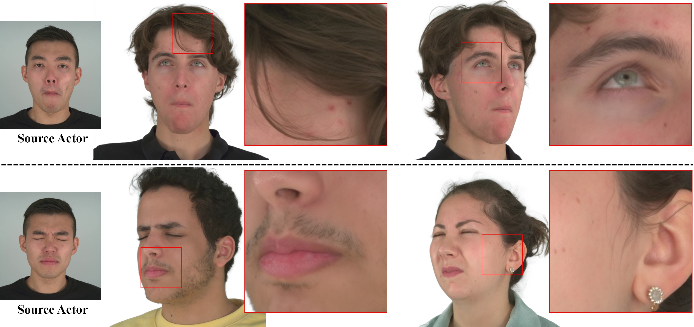

# Gaussian Head Avatar: Ultra High-fidelity Head Avatar via Dynamic Gaussians
## [Paper](https://arxiv.org/abs/2312.03029) | [Project Page](https://yuelangx.github.io/gaussianheadavatar/)
 

## Requirements
* Create a conda environment.
```
conda env create -f environment.yaml
```
* Install [Pytorch3d](https://github.com/facebookresearch/pytorch3d).
```
pip install --no-index --no-cache-dir pytorch3d -f https://dl.fbaipublicfiles.com/pytorch3d/packaging/wheels/py38_cu113_pyt1120/download.html
```
* Install [kaolin](https://github.com/NVIDIAGameWorks/kaolin).
```
pip install kaolin==0.13.0 -f https://nvidia-kaolin.s3.us-east-2.amazonaws.com/torch-1.12.0_cu113.html
```
* Install diff-gaussian-rasterization and simple_knn from [gaussian-splatting](https://github.com/graphdeco-inria/gaussian-splatting). Note, for rendering 32-channel images, please modify "NUM_CHANNELS 3" to "NUM_CHANNELS 32" in "diff-gaussian-rasterization/cuda_rasterizer/config.h".
```
cd path/to/gaussian-splatting
# modify "submodules/diff-gaussian-rasterization/cuda_rasterizer/config.h"
pip install submodules/diff-gaussian-rasterization
pip install submodules/simple-knn
```
* Download ["tets_data.npz"](https://drive.google.com/file/d/1SMkp8v8bDyYxEdyq25jWnAX1zeQuAkNq/view?usp=drive_link) and put it into "assets/".


## Datasets
We provide a [mini demo dataset](https://cloud.tsinghua.edu.cn/f/9c7345f71fb644818ef6/?dl=1) [(Google Drive)](https://drive.google.com/file/d/1OddIml-gJgRQU4YEP-T6USzIQyKSaF7I/view?usp=drive_link) from [NeRSemble dataset](https://tobias-kirschstein.github.io/nersemble/). Please download it for checking whether the code is runnable.

If you need to preprocess full [NeRSemble dataset](https://tobias-kirschstein.github.io/nersemble/) or a customized dataset:
* Download [NeRSemble dataset](https://tobias-kirschstein.github.io/nersemble/) and unzip it into "path/to/raw_NeRSemble/".
* Extract the images, cameras and background for specific identities into a structured dataset "NeRSemble/{id}".
```
cd preprocess
python preprocess_nersemble.py
```
* Remove background using [BackgroundMattingV2](https://github.com/PeterL1n/BackgroundMattingV2). Please git clone the code. Download [pytorch_resnet101.pth](https://drive.google.com/file/d/1zysR-jW6jydA2zkWfevxD1JpQHglKG1_/view?usp=drive_link) and put it into "path/to/BackgroundMattingV2/assets/". Then run the script we provide "preprocess/remove_background_nersemble.py".
```
cp preprocess/remove_background_nersemble.py path/to/BackgroundMattingV2/
cd path/to/BackgroundMattingV2
python remove_background_nersemble.py
```
* Fit BFM model for head pose and expression coefficients using [Multiview-3DMM-Fitting](https://github.com/YuelangX/Multiview-3DMM-Fitting). Please follow the insturctions.

## Training
First, edit the config file, for example "config/train_meshhead_N031", and train the geometry guidance model.
```
python train_meshhead.py --config config/train_meshhead_N031.yaml
```
Second, edit the config file "config/train_gaussianhead_N031", and train the gaussian head avatar.
```
python train_gaussianhead.py --config config/train_gaussianhead_N031.yaml
```

## Reenactment
Once the two-stage training is completed, the trained avatar can be reenacted by a sequence of expression coefficients. Please specify the avatar checkpoints and the source data in the config file "config/reenactment_N031.py" and run the reenactment application.
```
python reenactment.py --config config/reenactment_N031.yaml
```


## Acknowledgement
Part of the code is borrowed from [gaussian-splatting](https://github.com/graphdeco-inria/gaussian-splatting).

## Citation
```
@inproceedings{xu2023gaussianheadavatar,
  title={Gaussian Head Avatar: Ultra High-fidelity Head Avatar via Dynamic Gaussians},
  author={Xu, Yuelang and Chen, Benwang and Li, Zhe and Zhang, Hongwen and Wang, Lizhen and Zheng, Zerong and Liu, Yebin},
  booktitle={Proceedings of the IEEE/CVF Conference on Computer Vision and Pattern Recognition (CVPR)},
  year={2024}
}
```